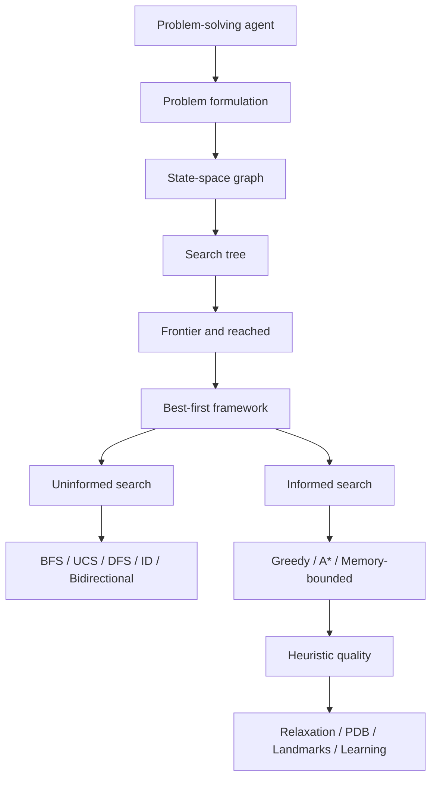

# Concept Map

## Core Relationships

- A problem definition determines the state-space graph.
- Search generates a tree of paths over that graph.
- The frontier ordering determines which node is expanded next.
- `reached` controls redundant paths and affects memory.
- $f$ specializes best-first search: depth, $g$, $h$, or $g+h$.
- Heuristic conditions determine A* guarantees; heuristic quality determines practical effort.
- Memory-bounded algorithms preserve A*-like guidance while trading storage for regeneration.

Return to [[00 - Chapter Home|Chapter Home]].

